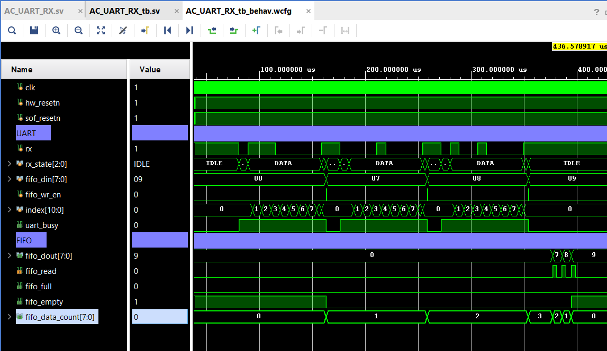
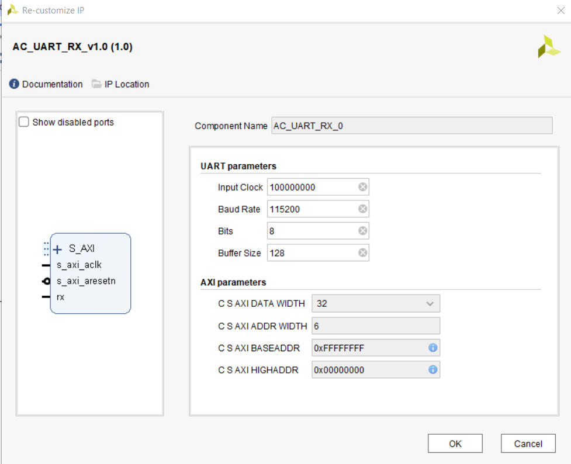
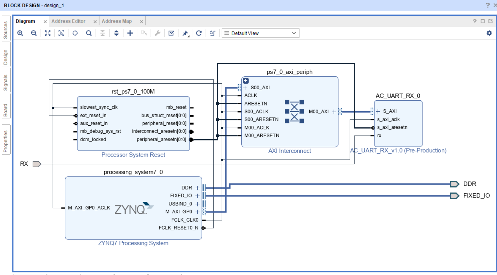

# AC_UART_RX IP

This repository hosts the AC_UART_RX IP, a custom Intellectual Property (IP) block designed for UART reception, tested on the ARTY Z7-20 board with Vivado 2021.1.

## Overview

Developed by Amir Chernin (AC), the AC_UART_RX IP complements the AC_UART_TX IP by providing robust and configurable UART data reception. It addresses the limitations of Xilinx's standard AXI UART Lite IP and offers enhanced configurability and flexibility, suitable for various communication requirements.

## Features

- **Configurable UART Baud Rate:** Supports up to 5 MHz.
- **Variable Word Length:** Adjustable from 1 to 32 bits.
- **Adjustable Buffer Size:** Allows customization of the FIFO buffer size.
- **Word Delay:** Adds inter-word delays in microseconds to aid in receiver data synchronization.

## Technical Implementation

The IP employs Xilinx's XPM (Xilinx Parameterized Macros) for FIFO implementation, facilitating buffer parameter modifications directly through code.

## Simulation

Simulation processes were executed to validate the functionality of the IP:

- **FIFO Configuration and Operation:** Initial setup and functioning of the FIFO buffer.
- **UART Reception:** Basic UART data reception using the custom FIFO buffer.

### Simulation Images

- 

## Packaging

The IP underwent thorough testing on real hardware to ensure reliable operation:

- **AXI Integration:** Packaged as a custom AXI-Lite IP and integrated with the ZYNQ IP on the ARTY Z7-20 board.
- **Driver Implementation:** A simple driver was crafted on the processor side to manage communication.
- **Multi-channel Testing:** Verification of three simultaneous UART configurations using a logic analyzer.

### Blcok Design View

<table>
  <tr>
    <td></td>
    <td></td>
  </tr>
  <tr>
    <td align="center">IP Internal View</td>
    <td align="center">Block Design View</td>
  </tr>
</table>

